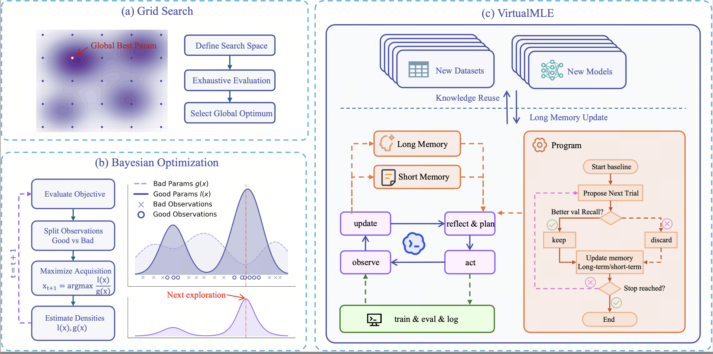

# VirtualMLE: A Virtual ML Engineer for Sequential Recommender Optimization

VirtualMLE is a compact release-style workspace for studying how an LLM agent can optimize sequential recommenders through **planning, execution, reflection, memory, and transfer**.

This subdirectory focuses on a clean and reproducible release version of the project, centered on:

- minimal SASRec and HSTU baselines,
- per-domain release cells,
- reflection-guided search protocols,
- and transferable optimization hints distilled from larger experimental workspaces.

## Overview

For a high-level framework overview, please see:



## Implementation Context

This VirtualMLE release was implemented in **Trae**, with the agent workflow and code generation process using **GPT-5.4**.

## Core Idea

VirtualMLE treats recommender optimization as an engineer-like closed loop rather than plain hyperparameter search.

The optimization cycle is:

> **plan -> run -> observe -> reflect -> update memory -> transfer**

Instead of only recording metrics, the framework aims to capture:

- what changed,
- why the change was expected to help,
- what actually happened,
- and what reusable rule should be transferred to future runs.

## VirtualMLE currently contains:

- `SASRec/run_sasrec.py` — minimal SASRec release baseline;
- `HSTU/run_hstu.py` — minimal HSTU release baseline;
- per-domain release cells such as `SASRec/Baby/` and `HSTU/Beauty/`;
- `overview.pdf` — the framework overview figure/document;
- `prior_rerank_summary.md` — a note summarizing richer prior/rerank ideas from the experimental SASRec branch.

## Supported Backbones

The current release branch supports:

- **SASRec**
- **HSTU**

These runners are intentionally simpler than the full experimental workspaces under the repository root.

## Supported Datasets

The current release cells include datasets such as:

- Amazon Baby
- Amazon Beauty
- Amazon Pet Supplies
- MovieLens

Each dataset cell contains its own `sequential_data_processed.txt` and `program_reflection.md`.

## Evaluation Principle

The intended search protocol is:

- use **validation metrics only** for keep/discard decisions,
- avoid using the **test set as a tuning signal** during the search loop,
- and keep data preparation fixed while exploring model and training choices.

## Quick Start

### SASRec

```bash
cd VirtualMLE/SASRec/Baby
python ../run_sasrec.py --domain baby --output_json output/run_result_baby.json
```

### HSTU

```bash
cd VirtualMLE/HSTU/Baby
python ../run_hstu.py --domain baby --output_json output/run_result_baby.json
```

## Reflection Files

Each release cell includes a `program_reflection.md` file describing:

- the optimization protocol,
- the search backlog,
- validation-only model selection rules,
- and, in some cases, transfer lessons for the current dataset.

For example:

- `SASRec/Baby/program_reflection.md`
- `HSTU/Baby/program_reflection.md`


## Design Goal

The main goal of this release directory is to provide a compact and auditable version of VirtualMLE that still preserves the central research idea:

> an LLM agent can function as a practical virtual ML engineer for sequential recommendation.
